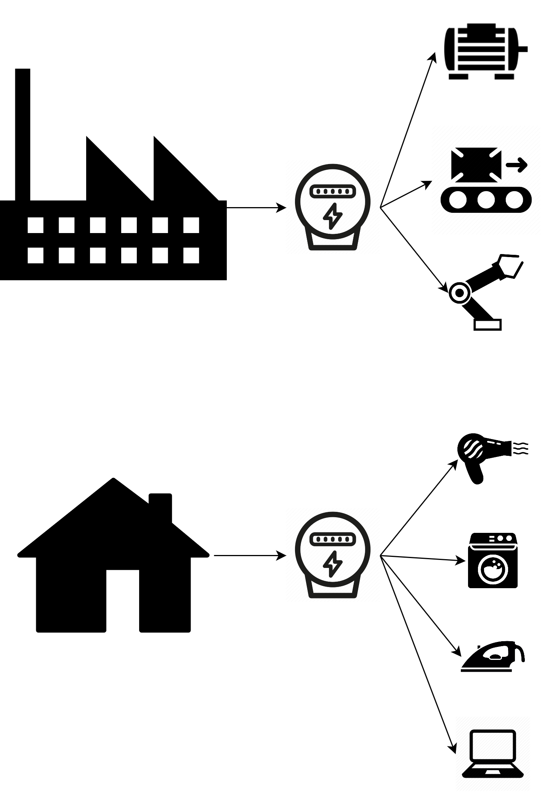

<h1 align="center">
  <a href="https://github.com/links-nilm-thesis-21/load-disaggregation" title="Deep Reinforcement Learning for autonomous systems Documentation">
    
  </a>
  <br/>
  Semi-supervised Event Pairing Method for Non-intrusive Load Monitoring
</h1>

<p align="center">
  Designing an event-based algorithm to separate the power profile of electricity-powered devices from an aggregated power signal in different application environments.
</p>

<p align="center">
 

</p>

## Table of Contents

- [Table of Contents](#table-of-contents)
- [Introduction](#introduction)
  - [Candidate](#candidate)
  - [Supervisors](#supervisors)
- [Abstract](#abstract)
- [Repository Structure](#repository-structure)
  - [Master Thesis](#master-thesis)
  - [Source Code](#source-code)
## Introduction

The Official repository of my master thesis in Information and Communications Technologies for Smart Societies at Politecnico di Torino.

The project was developed at Links Foundation (Turin, Italy) with prof. Michela Meo (Politecnico di Torino), M.Sc Piero Macaluso (Links Foundation) and M.Sc. Hamidreza Mirtaheri (Links Foundation).

### Candidate

-  **Juan Gabriel Pieschacón Vargas** - [jpieschacon](https://github.com/jpieschacon)

### Supervisors

-  **Prof. Michela Meo** - [meo.michela](https://www.telematica.polito.it/member/michela-meo/)
-  **M.Sc. Piero Macaluso** - [pieromacaluso](https://github.com/pieromacaluso)
-  **M.Sc. Hamidreza Mirtaheri** - [mirtaheri](https://github.com/mirtaheri)

## Abstract

The increasing deployment of energy management systems (EMS) is assisting end-users to become more aware of their energy consumption, intending to mitigate energy waste. In this context, non-intrusive load monitoring (NILM) has emerged as a promising energy management technique to conserve energy. This method aims at distinguishing the individual load consumption from the aggregate power signal measured at a single point. 
	The majority of NILM methods have been applied to residential settings. Low data availability in the industrial domain makes it difficult to study solutions to disaggregate appliances in this kind of environment.

In this work, the household and industrial fields are analyzed and compared. A semi-supervised event pairing method was applied to both scenarios. The algorithm consists of (i) a cluster-based event detection; (ii) the extraction of specific features from each of the events obtained from a small appliance-specific training set; (iii) labels for each detected event of the aggregated power measurement; and (iv) an estimation of the individual load consumption for the present electric devices in the establishment.

The REDD residential and the IMDELD industrial datasets are the considered case studies to evaluate the performance of the proposed approach.
	For both, residential and industrial applications, it was found that for frequent event appliances, the algorithm accurately detects and classifies the events. Despite this significant result, there is a performance gap for devices that lack frequent events. Thus, an analysis of the strengths and weaknesses of this approach was carried out to define further research ideas or next steps.

## Installation requirements

```shell
conda env create --file ./requirements_env.yml
```

## Repository Structure

### Master Thesis

| Document      | Status |                                                            PDF                                                             |         Project Folder         |
| :------------ | :----: | :------------------------------------------------------------------------------------------------------------------------: | :----------------------------: |
| Master Thesis |  WIP   | [:page_facing_up:](https://github.com/links-nilm-thesis-21/load-disaggregation/raw/master/master_thesis/master_thesis.pdf) | [:file_folder:](master_thesis) |
| Summary       |  WIP   |       [:page_facing_up:](https://github.com/links-nilm-thesis-21/load-disaggregation/raw/master/summary/thesis_summary_.pdf)       |    [:file_folder:](summary)    |

### Source Code

#### Train and test scripts

- [Event-based NILM](SSEPM_NILM)

## Contibutions and License

Please cite using the following BibTex entry:

```latex
@unpublished{webthesis20414,
           month = {December},
            year = {2021},
           title = {Semi-supervised Event Pairing Method for Non-intrusive Load Monitoring},
          school = {Politecnico di Torino},
          author = {Juan Gabriel Pieschacon Vargas},
             url = {http://webthesis.biblio.polito.it},
        abstract = {The increasing deployment of energy management systems (EMS) is assisting end-users to become more aware of their energy consumption, intending to mitigate energy waste. In this context, non-intrusive load monitoring (NILM) has emerged as a promising energy management technique to conserve energy. This method aims at distinguishing the individual load consumption from the aggregate power signal measured at a single point. 
	The majority of NILM methods have been applied to residential settings. Low data availability in the industrial domain makes it difficult to study solutions to disaggregate appliances in this kind of environment. In this work, the household and industrial fields are analyzed and compared. A semi-supervised event pairing method was applied to both scenarios. The algorithm consists of (i) a cluster-based event detection; (ii) the extraction of specific features from each of the events obtained from a small appliance-specific training set; (iii) labels for each detected event of the aggregated power measurement; and (iv) an estimation of the individual load consumption for the present electric devices in the establishment. The REDD residential and the IMDELD industrial datasets are the considered case studies to evaluate the performance of the proposed approach.
	For both, residential and industrial applications, it was found that for frequent event appliances, the algorithm accurately detects and classifies the events. Despite this significant result, there is a performance gap for devices that lack frequent events. Thus, an analysis of the strengths and weaknesses of this approach was carried out to define further research ideas or next steps.}
```